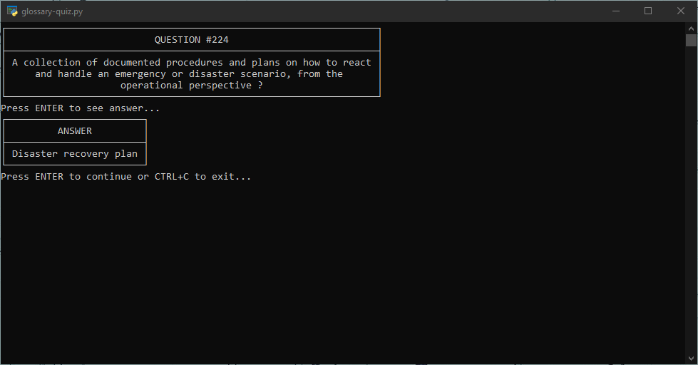

# Flash Quiz

A digital flash card quiz program. It loads the questions from a csv-like file and will display a random card with the answer hidden until the user interacts with it. It continues displaying new questions until the user exits. There are two versions available: A terminal-based script that runs in Python and a web app.

## Usage

### Python
Simply run the script using Python. Press the **ENTER** key to display the answer and press **ENTER** again to show the next question. To exit press **CTRL+C**. These controls will also be displayed on the first question.

`python flash-quiz.py`

### Web
Install json-server and then run the npm script called 'quiz-glossary' which serves the quiz data to the web app. Then open 'index.html' in a web browser. Click on the card to flip it over and use the buttons on the bottom to navigate or choose a random card.

`npm run quiz-glossary`

## Requirements

### Python
- Python 3
- tabulate

`pip install tabulate`

### Web
- Node/NPM
- json-server

## FAQ

| Question | Answer |
| -------- | ------ |
| The script isn't working correctly. | Make sure you have a file named 'quiz-questions.txt' in the same directory as 'flash-quiz.py'. Note also that the default delimitting character in the script is ':' rather than the typical ',' in an average csv file. |
| I get an error when I try to run the script. | Do you have Python 3 installed and on your system path? Do you have the tabulate package installed? Verify that both are installed correctly. Also note that the os.system('cls') command used in the script might not work for all terminals. Try running it in PowerShell. |
| I have another issue. | Feel free to send me a message if you can't get it working! |

## Acknowledgements

Questions in the included 'quiz-questions.txt' file are from the Google IT Support course glossary with some minor modifications of my own.

## License

MIT License (See LICENSE file for details)
